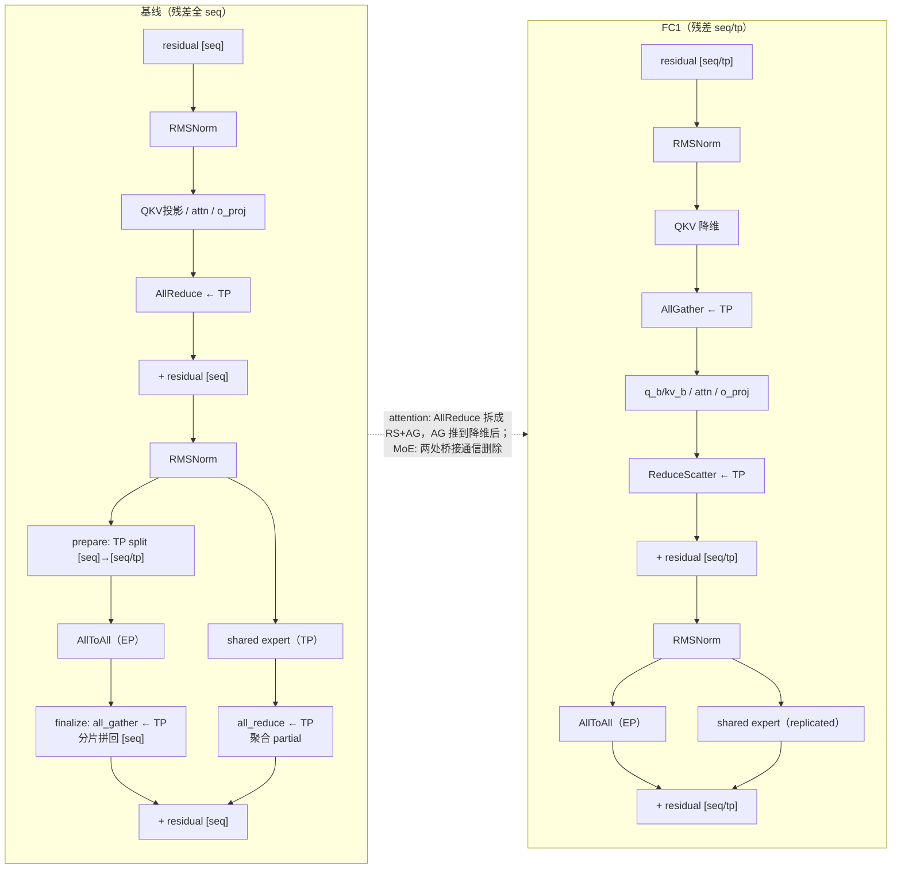

大模型推理离不开张量并行（TP）和专家并行（EP），而每并行一层，最后都得把各卡上的部分结果汇总到一起——这件事几乎都交给 **AllReduce** 来做。DeepSeek V3/R1、Llama 3.1-70B 这类模型，每一层要做两次 AllReduce。随着模型变大、序列变长，这个原本不起眼的算子，逐渐成了性能瓶颈。

## 问题出在哪

AllReduce 方案有两个结构性痛点。

一是**通信量大且"绑死"**。AllReduce 在原理上等价于 `ReduceScatter + AllGather` 的组合。直接用一个 AllReduce 算子，虽然能省一次通信启动开销，却把两步绑死在一起，没法"先降维、量化、再通信"来压缩数据量。

二是**后面跟着一堆冗余计算**。AllReduce 一做完，通信域里每张卡都拿到一模一样的完整数据，于是 RMSNorm、动态量化、MLA 的 QKV 降维这些算子，会在每张卡上重复算一遍。并发小的时候不显眼，并发一大就是真金白银的时延。

直觉其实很简单：既然后面某一步本来就要把张量压小（降维）、筛掉一部分（gating）、或者压位宽（量化），那干嘛还要提前把完整张量通信出来？

FlashComm1 就是顺着这个直觉，把 AllReduce 拆开、把通信往后推、再把能省的计算省掉。

## FlashComm1 怎么做：拆、推

两步走：

- **拆**：把 AllReduce 拆成 `ReduceScatter + AllGather`，拿到两个能独立编排的算子。这一步本身只是数学等价，真正起作用的是下面这一步。
- **推**：把 RMSNorm / QKV 降维 / Gating / 动态量化这些"逐 token"算子，从 AllGather 之后挪到 ReduceScatter 和 AllGather 之间。这样 AllGather 通信的就是降维后、量化后、或筛过路由的激活，而不是完整的 hidden states。

> 注：NPU 上把 matmul 和 ReduceScatter 融成单个算子、省启动开销，是常见的工程实现手段，并不属于 FC1 的技术思想本身，本文不展开。

改造前后的对比一目了然：

不同结构的模型，"推"的落点不同：

| 模块 | AllGather 推到哪 | 通信对象变成了什么 |
| --- | --- | --- |
| MLA | QKV 投影之后 | 降维后的低维激活 |
| MoE | Gating + 动态量化之后 | 路由筛过 + INT8 压位宽 |
| 稠密 FFN | RMSNorm + 动态量化之后 | BF16 → INT8 |

## 为什么敢这么推

能把这些算子挪到通信中间，靠的是它们都有同一个性质：**逐 token 独立**——每个 token 的计算只依赖自己那一行，不和其他 token 混着算。RMSNorm 是逐行归一化、动态量化是逐行量化、Gating 是逐行算路由、QKV 降维是逐行投影，全都满足这一点。

对这类算子 $C$，有一个干净的等价关系：先 AllReduce 再算 $C$，和先 ReduceScatter、在分片上算 $C$、再 AllGather，结果完全一样：

$$C(\text{AllReduce}(X)) \;=\; \text{AllGather}\big(C(\text{ReduceScatter}(X))\big)$$

等式一成立，把它们前移到分片上就是白赚：每卡只处理 $1/\text{tp}$ 的 token，计算量直接降到 $1/\text{tp}$；同时 AllGather 搬运的是更小、更低比特的张量。唯一要注意的是浮点累加顺序变了，数值上会有极小偏差，训推一致场景需要评估一下。

> 原始报告把这个性质称作「列向无关」（column-independent），并给出了严格的定义与证明，想看完整推导可以翻原文。

## FC1 和 SP 的区别

先说清 SP 是什么。**SP（Sequence Parallelism）是一种并行方式**，最早出自 Megatron-LM（Korthikanti et al., 2022）。在普通张量并行里，LayerNorm、Dropout 这类算子并不切分权重，于是在每张卡上都被重复算一遍、重复存一份。SP 的做法是把它们沿**序列维度**切开，每卡只处理一段 token——初衷是**省激活显存**（训练长序列时尤为关键），副产品是顺带减少了 LayerNorm 的冗余计算。通信上，原来 TP 末尾的 AllReduce 被替换成 `ReduceScatter + AllGather`，LayerNorm 才得以跑在序列分片上。SP 是个通用技术，任何 Transformer 结构都能用，并不局限于某一类模型。

FC1 走的是同一条 `ReduceScatter + AllGather` 分解，但目标不同——它是**面向推理时延的通信优化**，在 SP 的思路上再往前走三步：

- **推得更远**：SP 只把 AllGather 推到 LayerNorm 之后；FC1 在 MLA 里推到 **QKV 投影之后**，在 MoE 里推到 **Gating + 动态量化之后**，让 AllGather 通信的是降维 / 低比特 / 筛过路由的激活，而不是完整 hidden states。

  > - FC1在MLA
  >
  > 
  >
  > - FC1在MoE
  >
  > 

- **真正消除冗余计算**：SP 主要是省显存，LayerNorm 那点计算收益其实很小；FC1 把 RMSNorm、动态量化、Gating、QKV 降维都挪到分片上、每卡只算 $1/\text{tp}$，把这部分冗余实打实地砍掉。

一句话：**SP 是一种省显存的并行方式（拆 AllReduce、沿序列切分）；FC1 借用了它的分解，再叠加"推得更远 + 消除冗余"，把同样的思路变成了推理时延优化。**

## 深度优化：MoE 走 AllToAll 时的进一步收益

在 910C 这类超节点上部署 DeepSeek-R1 这样的大 EP 模型时，MoE 阶段的通信通常选择 AllToAll——按 token 路由将 token 派发至持有对应 expert 的卡上计算、再回收。此时 FC1 仍有进一步优化的空间：FC1 对残差流的序列分片操作与专家并行的 AllToAll 操作分属正交维度，二者互不干扰，因而能够规避 MoE 阶段为对齐全序列残差而引入的部分 TP 通信。换言之，attention 侧的「拆 · 推」收益照常生效，AllToAll 路径上还额外消除了两次全 `H` 的 TP 集合通信。基线与 FC1 的链路对照如下。

图中左侧为基线、右侧为 FC1。

**attention 段**：基线以一次 AllReduce 聚合 o_proj 输出；FC1 将其拆解为 ReduceScatter 与 AllGather，并将 AllGather 推后至 QKV 降维之后，使通信对象由全 `H` 的 hidden states 变为低维激活。残差流因此由全 `[seq]` 转为 `[seq/tp]` 分片，这是后续 MoE 段优化的前提。

**MoE 段**：基线先经 `prepare` 将 `[seq]` 沿 TP 切分为 `[seq/tp]`，各 rank 在自身分片上执行 AllToAll 的 dispatch/combine，再由 `finalize` 的 `all_gather` 将分片拼回全 `[seq]`——split 与 all_gather 构成配对；另一支路 shared expert 在 TP 维度按权重切分、各 rank 仅得 partial 结果，须经 `all_reduce` 聚合。FC1 下残差已为 `[seq/tp]`，`prepare` 无需切分、`finalize` 的 `all_gather` 无需拼回、shared expert 复制为 replicated 亦无需 `all_reduce`，三处通信一并消除，MoE 子块仅保留 AllToAll 的 EP 搬运。

### 为什么这是个干净组合

一句话来说，MoE走AllToAll时本质也是**逐token独立**的：

1. **AllToAll 对残差形态不敏感**。其语义是将各 rank 的 token 按路由派发至 expert 所在卡、计算后回收，仅依赖路由结果，与每 rank 持有全 `[seq]` 还是 `[seq/tp]` 无关。因此 FC1 将残差由 `[seq]` 切分为 `[seq/tp]`，并不影响 AllToAll 的 dispatch/combine，仅使每 rank 派发的 token 数减少。

2. **那两次桥接通信并非 AllToAll 所需，而是全序列残差所迫**。基线残差为全 `[seq]`，而 AllToAll 回收的 routed 结果仅覆盖本 rank 的 `[seq/tp]` 分片，为对齐全 `[seq]` 残差须 `all_gather` 拼回；shared expert 在 TP 维度按权重切分、各 rank 仅持 partial，为得到完整结果须 `all_reduce`。二者存在的唯一理由是残差流为全 `[seq]`。

3. **残差一旦分片，二者即失去依据**。FC1 使残差保持 `[seq/tp]`，AllToAll 的 `[seq/tp]` 输出与之天然对齐，`all_gather` 无需拼回；shared expert 复制为 replicated，各 rank 在自身分片上即得完整结果，`all_reduce` 无需聚合。两次桥接通信同时失效，被一并删除。

就 MoE 子块而言，通信开销对照如下：

| 通信 | 基线 AllToAll | FC1 + AllToAll | FC1 节省 |
| --- | --- | --- | --- |
| AllToAll dispatch/combine | EP | EP | 不变（EP 维度 token 搬运量由路由决定，与残差是否分片无关） |
| MoE 路由输出 TP 重建 | `all_gather`(全 H)，拼回 `[seq]` | **删除** | ≈ `(tp−1)/tp·seq·H` |
| shared expert 聚合 | `all_reduce`(全 H)，聚合 partial | **删除**（replicated） | ≈ `2·(tp−1)/tp·seq·H` |

按一层计（`tp_size > 1`，全 `H` 口径）：MoE 子块消除两次全 `H` 的 TP 集合通信——一次 `all_gather`（约 `(tp−1)/tp·seq·H`）与一次 shared `all_reduce`（环形近似约 `2·(tp−1)/tp·seq·H`），合计约 `3·(tp−1)/tp·seq·H` 的通信量；AllToAll 自身的 EP 搬运量不变。

## 效果

机制上的收益可以量化：通信数据量降 **25%–35%**，被前移的算子计算量降到 **1/8**（TP8）。落到端到端，在 Atlas 800I A2 上实测：

**DeepSeek V3/R1（2 节点 16 卡，Prefill）**

| 总并发 | 序列长度 | 基线 (ms) | FC1 (ms) | 收益 |
| --- | --- | --- | --- | --- |
| 16 | 1024 | 942 | 691 | **26.5%** |
| 8 | 2048 | 951 | 699 | 26.2% |
| 4 | 4096 | 1003 | 753 | 24.9% |
| 2 | 8192 | 1108 | 849 | 22.5% |

**Llama 3.1-70B（单节点 8 卡，A8W8 量化，Decode）**

| 总并发 | 基线 (ms) | FC1 (ms) | 收益 |
| --- | --- | --- | --- |
| 16 | 17.9 | 17.2 | 3.9% |
| 64 | 23.4 | 22.2 | 5.1% |
| 256 | 41.4 | 38.2 | 7.7% |
| 512 | 70.3 | 60.5 | **13.9%** |

两个结论：Prefill 收益显著（22%–26%），Decode 收益随并发增长（4%–14%）。道理也直白——并发越高，通信和冗余计算占的比重越大，而 FC1 压的正是这部分，所以收益越明显。

## 小结

FlashComm1 的精髓就一句话：**AllReduce = ReduceScatter + AllGather，把逐 token 算子塞进中间，让通信变小、让计算不冗余。** 它没改模型的并行方式，只是重新编排了通信和计算的位置，就在 DeepSeek、Llama 等模型上稳定换来了 20%+ 的 Prefill 时延收益。

---

## 参考资料

- 原始技术报告：《FlashComm：大模型推理中的 AllReduce 通信优化技术》（华为，2025-05-22）—— https://gitcode.com/ascend-tribe/ascend-inference-cluster/blob/main/FlashComm/ascend-inference-cluster-flashcomm.md
- SP 出处：Korthikanti et al., *Reducing Activation Recomputation in Large Transformer Models*（Megatron-LM，MLSys 2023）
- vllm-ascend 文档：[Sequence Parallelism](https://github.com/vllm-project/vllm-ascend/blob/main/docs/source/user_guide/feature_guide/sequence_parallelism.md)
- RFC [#5712 [RFC]: support sequence parallelism by pass](https://github.com/vllm-project/vllm-ascend/issues/5712)
- PR [#5632 [Feat]support sequence parallelism by pass for VL models](https://github.com/vllm-project/vllm-ascend/pull/5632)
- PR [#7044 [Feat][SP] Suport SP for VL MoE models](https://github.com/vllm-project/vllm-ascend/pull/7044)
