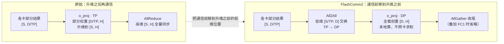
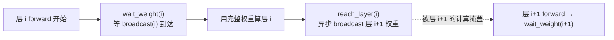
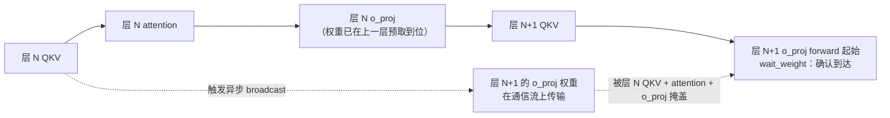

大模型推理里，张量并行（TP）每层一次 `AllReduce` 是核心通信瓶颈。FlashComm2（FC2）的做法是：把 o_proj 之后的 `AllReduce` 前移成 o_proj 之前的 `All2All`，让通信发生在升维之前的低维位置——代价是每张卡都得持有完整的 o_proj 权重，也就是「**以存换传**」。这篇文章讲三件事：FC2 怎么以存换传、Shard Linear 怎么用层间权重分布消除冗余、以及二者结合的 FC2-Oshard 怎么把「存」的代价再压回去。

**符号约定**：`n` = 层数，`H` = hidden_size，`D` = num_heads × head_dim，`S` = bs × seqlen，`TP` = 张量并行度。

---

## 引子：从 SP → FlashComm1 → FlashComm2 的三步演进

TP 每层一次 `AllReduce`，有三个结构性问题：

1. **通信量大，且绑死在升维之后**。o_proj 之后的 `AllReduce` 在 `[S, H]` 的高维空间全量同步，通信量随 `H` 线性增长；而它本可以挪到 o_proj 升维之前的低维位置。
2. **时机过早**。`AllReduce` 一做完，每张卡都拿到完整结果，可它后面紧跟的逐 token 算子（LayerNorm、动态量化、QKV 降维）未必需要完整张量，却被迫先等通信完成。
3. **后面跟着一堆冗余计算**。`AllReduce` 之后各卡持有相同数据，于是 RMSNorm、动态量化、QKV 降维这些逐 token 算子在每张卡上重复算一遍——这一点和[FlashComm1：把 AllReduce 拆开、推后 ](https://levi-jq.github.io/2026/06/29/flashcomm1-allreduce-optimization/)里说的一样。

vllm-ascend 沿「把 `AllReduce` 拆为 `ReduceScatter + AllGather`，再尽量把 `AllGather` 往后推」这条主线，迭代出三套**递进而非互斥**的优化方案：

| 方案 | 核心动作 | 一句话 |
| --- | --- | --- |
| SP | **拆** | `AllReduce → LayerNorm` 改写为 `ReduceScatter → LayerNorm → AllGather`，让逐 token 算子先在分片上做 |
| FlashComm1 (FC1) | **拆 + 推** | 在「拆」之上把 `AllGather` 延后到 QKV 投影 / Gating+DynamicQuant 之后，让 `AllGather` 通信的是降维 / 低比特的激活值 |
| FlashComm2 (FC2) | **以存换传** | 针对 o_proj 路径，取消O矩阵的TP切分、在O矩阵前用 `All2All` 把 TP 重排为 DP，在低维处通信，实现「以存换传」 |

FC1 已经把 `AllGather` 优化到降维 / 量化后的低比特位置，但**残留的 `ReduceScatter` 仍在升维后的高维空间传输**。FC2 的出发点正是：能否把这条残留的 `ReduceScatter` 也消掉？答案是——**用一次 `All2All` 替代它，代价是 o_proj 权重全冗余复制**。这就是「以存换传」，而这个「存」的代价，正是第三部分 FC2-Oshard 要解决的问题。

*原始 `AllReduce(o_proj 之后)` 与 FC2 `All2All(o_proj 之前) → o_proj(DP) → 聚合` 的对比流程。*

---

## 第一部分：FlashComm2 —— 以存换传

### 1.1 场景与痛点

随着模型规模增长，推理通信开销显著上升、逐渐成为瓶颈，Attention 的 o_proj 路径尤为突出。FC1 之后，o_proj 路径仍残留 `ReduceScatter`——在 o_proj 升维之后的 `[S, H]` 高维空间上规约，通信量 $SH(TP-1)/TP$ 随序列长 $S$、模型宽度 $H$ 增大而上升。Prefill 阶段 $S$ 大，这步通信尤为显著；高 TP 下单卡计算量按 $1/TP$ 下降、这步通信量却随 TP 趋向 $SH$（$(TP-1)/TP \to 1$），通信在层时延中的占比随之升高。这正是 FC2 在 Prefill、高 TP 下收益最大的背景。

FC2 的核心问题：**能否把通信前移到升维矩阵乘之前的低维位置，用 `All2All` 替代 `ReduceScatter`？** 这要求把 o_proj 的并行模式从 TP 转为 DP——而 DP 成立的前提，是每张卡都持有**完整**的 o_proj 权重。用权重显存冗余换通信量下降，即「**以存换传**」。

### 1.2 设计思想：通信前置 + TP→DP + 本地计算

FC2 在 o_proj 路径上做四步重构：

1. **通信前置**：把 o_proj 之后的 `AllReduce`，改为 o_proj **之前**的 `All2All`；
2. **模式转换**：`All2All` 把 TP 转为 DP（每卡拿到 `[S/TP, D]` 的完整特征维、1/TP 的 token，而非 `[S, D/TP]` 的分片）；
3. **本地计算**：DP 模式下用全载权重 `[D, H]` 做完整矩阵乘 o_proj，无需跨卡求和；
4. **结果聚合**：尾部 `AllGather` 把 1/TP 的 token 收回成完整结果（与 FC1 叠加时该步被后移 / 省略）。

### 1.3 数学原理：通信前置为什么等价

FC2 能把通信从「升维矩阵乘之后」挪到「之前」，靠的是一条等价关系。先看原始 TP 方案怎么做 o_proj：

- 输入 $X$ 沿特征维 $D$ 切到 TP 张卡，第 $i$ 卡持 $X_i$，形状 $[S,\, D/TP]$；
- 权重 $W$ 沿 $D$ 行切，第 $i$ 卡持 $W_i$，形状 $[D/TP,\, H]$；
- 每卡算部分积 $X_i W_i$（形状 $[S, H]$），再 `ReduceScatter`：先对部分积求和 $\sum_i X_i W_i$，再沿 token 维散开，第 $i$ 卡拿到完整结果 $XW$ 的第 $i$ 个 token 切片，形状 $[S/TP,\, H]$。

FC2 换一种切法——**不切权重、改切 token**：

- `All2All` 把每卡的 $[S,\, D/TP]$ 重排成 $[S/TP,\, D]$：第 $i$ 卡不再持某个特征切片，而是持**完整特征维 $D$**、只占 **1/TP 的 token**（即 $X$ 的第 $i$ 个 token 切片）。这一步把 TP 转成了 DP。
- 每卡持**全载**权重 $W$，形状 $[D, H]$，本地做矩阵乘，得到 $[S/TP,\, H]$。

两种切法下，第 $i$ 卡拿到的都是 $XW$ 的同一个 token 切片：

$$\underbrace{\text{All2All}(X)_i \cdot W}_{\text{FC2：取 token 切片 × 全载 } W} \;=\; \underbrace{\Big(\textstyle\sum_j X_j W_j\Big)_{\![i]}}_{\text{原始：部分权重求和后取切片}} \;=\; (XW)_{\![i]}$$

本质是分块矩阵乘的两种切法：原始按特征维切 $W$（每卡算一部分、再求和），FC2 按 token 切 $X$（每卡拿全 $W$、只算一部分 token）。**求和与切片的顺序换了，结果不变**——这就是「把 TP 转 DP」的严格基础。完整证明见原始技术报告。

### 1.4 通信量与计算量

**（1）通信量对比**

FC2 把一次 `AllReduce` 拆成 `All2All + AllGather`：`All2All` 在 o_proj 之前把 TP 重排成 DP，`AllGather` 在 o_proj 之后把 1/TP 的 token 收回。而 `AllReduce = ReduceScatter + AllGather`。两边的 `AllGather` 是同一件事、体积一样，只是位置挪了——**真正被替换的是 `ReduceScatter → All2All`，省的就是这一段**。

| 段 | 位置 | 搬的张量 | 每卡发送量 |
| --- | --- | --- | --- |
| `ReduceScatter`（被替代） | o_proj 之后，升维 | `[S, H]` 高维 | $\dfrac{SH(TP-1)}{TP}$ |
| `All2All`（替代者） | o_proj 之前，低维 | `[S, D/TP]` | $\dfrac{(SD/TP)(TP-1)}{TP}$ |

比值：

$$\frac{\text{All2All}}{\text{ReduceScatter}} = \frac{SD/TP}{SH} = \frac{D}{H\cdot TP}$$

以 Qwen3-235B-MoE为例（GQA，$D=2H$） 通信量比值为**$2/TP$**, 不考虑量化的情况下，也即 Qwen3-235B 需要 **$TP>2$** 时开启 FC2 才有收益；考虑 W8A8 量化时，`ReduceScatter` 在 o_proj 之后传输的是需跨卡浮点求和的部分积，需为 **FP16/BF16**，而 `All2All` 在 o_proj 之前传输的是量化后的激活，为 **INT8**，故字节比再降 2×，通信量比值为**$1/TP$**。

**（2）计算量对比**

从矩阵乘 $[M,N]\!\cdot\![N,K]$ 的角度看 o_proj 这一步（每卡）：

| 方案 | 左矩阵 $X$ | 右矩阵 $W$ | $M,\,N,\,K$ | 每卡 FLOPs |
| --- | --- | --- | --- | --- |
| 原始（TP） | $[S,\, D/TP]$ | $[D/TP,\, H]$ | $S,\; D/TP,\; H$ | $2S(D/TP)H = 2SDH/TP$ |
| FC2（DP） | $[S/TP,\, D]$ | $[D,\, H]$ | $S/TP,\; D,\; H$ | $2(S/TP)DH = 2SDH/TP$ |

两者 FLOPs **完全相同**（$2SDH/TP$）。差别只在形状：原始是大 $M$、小 $N$，FC2 是小 $M$、大 $N$——$M$ 缩 $TP$ 倍、$N$ 涨 $TP$ 倍。计算量没变，但 FC2 的右矩阵（权重）从 $[D/TP, H]$ 变为全载 $[D, H]$、涨 $TP$ 倍，权重搬运量随之上升。**通信省了，计算没多，多出来的是权重的「存」**——这正是「以存换传」中「存」的来源（详见 1.6）。

### 1.5 原始改进方案：用 OTP/ODP 调节「以存换传」的激进度

「以存换传」越激进（o_proj 权重复制得越全），通信越省、显存越费。原始技术报告给了一个方案来调这个度——自定义 o_proj 的 TP 切分大小 **otp**：otp=1 表示完全不切分、每卡全载；otp 越大，切得越碎、每卡载得越少。otp>1 时会引入两个通信组：

- **ODP（o_proj DP 组）**：组内做 `All2All`，把 TP 重排成 DP；
- **OTP（o_proj TP 组，大小=otp）**：组间做 `ReduceScatter`，把各卡部分 o_proj 结果汇总。

两种典型配置（单卡 o_proj 权重占用）：

*(a) 跨节点 All2All：otp=1，权重全载，通信最省。(b) 节点内 All2All + 节点间 ReduceScatter：otp=2，权重减半 ，多一次 ReduceScatter。*

所以 OTP/ODP 是原始方案用来在「省通信」和「省显存」之间找平衡的：otp=1 最省通信、最费显存；otp=2 显存省一半，代价是多一次otp组内的 `ReduceScatter`。

而第三部分的 Oshard 走的是另一条路：不靠切 otp（会引入 `ReduceScatter`），而是把全载的 o_proj 权重**按层分散**，用可被计算掩盖的 `broadcast` 代替 `ReduceScatter`——通信能藏进计算里，显存却照样省下来。

### 1.6「存」的代价

「以存换传」的「存」是 FC2 的核心代价。o_proj 权重从 TP 切分 `[D/TP, H]` 变为每卡全复制 `[D, H]`：

- **每卡显存增量**：$\dfrac{(D\times H)\times(TP-1)}{TP}$（原每卡 $D\times H/TP$，现 $D\times H$）；
- **集群总增量**：$(D\times H)\times(TP-1)$。

以 Qwen3-235B-A22B W8A8（TP16DP1，Prefill 4K tokens；$S{=}4096,\, H{=}4096,\, D{=}8192,\, TP{=}16$）为例：

| 指标 | FlashComm1（ReduceScatter） | FlashComm2（All2All，以存换传） |
| --- | --- | --- |
| 通信张量 | o_proj 后 `[S, H]`  BF16 | o_proj 前 `[S, D/TP]`  INT8 |
| 单卡通信量 | 基准 | 降至 1/16 |
| 矩阵乘计算量 | $2^{34}$ | $2^{34}$（相同） |
| 单卡 o_proj 权重 | 2 MB（TP 切分） | **32 MB**（全载，×16） |

矩阵乘整体计算量不变，通信量降到 1/16；代价是 o_proj 权重从 2 MB 涨到 32 MB 的全冗余复制——**这个「存」的代价，正是第三部分 FC2-Oshard 要化解的问题。**

### 1.7 收益

以 Qwen3-235B-A22B W8A8 为例，TTFT 指标，输入长度 256/512/1k/2k/4k/8k。TP16DP1配置下，收益随输入长度增长：

| 输入长度 | 256 | 512 | 1k | 2k | 4k | 8k | 平均 |
| --- | --- | --- | --- | --- | --- | --- | --- |
| 相对 origin | 15.96% | 18.35% | 15.96% | 17.72% | 22.70% | 28.63% | **19.89%** |

**收益分析**：

- **TP 越高、输入越长，收益越显著**：TP16DP1 平均 19.89%，8k 单点 28.63%；通信占比随 TP 和序列长度上升，FC2 压的正是这部分。

- **Profiling 算子级数据**（Qwen3-235B-MoE，TP16DP1，4k 输入，每层）：

| 算子 | 相对变化 |
| --- | --- |
| `all2all` vs `allreduce` | 1494.12→91.05us，优化 1407.07us |
| `MatMul` | 65.18→82.8us，劣化 17.62us |
| 整体理论（94 层） | $(1407.07-17.62)\times94 =$ **130.60ms** |

逐项看：

- **`all2all` 大幅省通信**（1494→91us）：原始在 o_proj 之后对 `[S,H]` 高维做 `AllReduce`，FC2 改在 o_proj 之前对 `[S,D/TP]` 低维做 `All2All`，通信量骤降，是收益主项。
- **`MatMul` 略有劣化**（65→83us）：o_proj 计算量不变（$2SDH/TP$），但右矩阵从 `[D/TP,H]` 变成全载 `[D,H]`、增大 TP 倍，搬运耗时增加——这是「以存换传」在算子层面付的小代价。

整体每层净省约 $(1407-18)\approx 1389$ us，理论 94 层合计约 **130 ms**。

**实测 TTFT**（TP16DP1，单位 ms）：

| 输入长度 | 256 | 512 | 1k | 2k | 4k | 8k |
| --- | --- | --- | --- | --- | --- | --- |
| origin TTFT | 195.22 | 199.64 | 216.65 | 322.05 | 506.29 | 1193.55 |
| FC2 TTFT | 164.07 | 163    | 182.08 | 264.98 | 391.36 | 851.81  |
| 实测节省 | 31.15 | 36.64 | 35.99 | 61.71 | 114.93 | 341.71 |

profiling 取自 4k 输入，对应表里 4k 列：origin 506.29→ FC2 391.36，实测省 **114.93 ms**（22.70%），与推算的 130 ms 量级一致，整体收益符合预期。

### 1.8 适用场景

FC2 的收益来自把高维通信压到低维，**通信占比越高、收益越大**：

- **Prefill（P 节点）适用**：长序列、高 TP 下激活值大、通信是瓶颈，FC2 正好压这部分，TP16DP1 平均收益近 20%。
- **Decode（D 节点）不适用**：batch 小、激活通信本就很小，以存换传输不回多少通信、反而背上权重全载的显存代价，挤压本就紧张的 KV cache——所以 FC2 当前只面向 Prefill。

---

## 第二部分：Shard Linear —— 层间权重分布 + 异步 broadcast 预取

### 2.1 场景

FC2 的「存」代价，本质是「同构层的同一份 o_proj 权重在每张卡上冗余复制」。已有的两种权重存放方式都不理想：`ReplicatedLinear` 存整个矩阵，显存太大；`RowParallelLinear` 要 `all_reduce` 合并，多一次通信还可能有精度损失，且每个 token 跨多卡、对 SP 不友好。

受训练里 FSDP / ZeRO 的启发，Shard Linear 换了个角度：**不切单层权重，而是在层间把权重分散到不同卡上**。

### 2.2 设计思想

**层间分布**。把所有同构层的 o_proj 权重拆成若干份，分到不同卡：GPU0 存第 0/2/4 层，GPU1 存第 1/3/5 层，其余层都指向一块 shared tensor。运行到某层时，从持有它的卡把权重接收过来、存进 shared tensor。每层权重在源卡上是完整的 `[D, H]`，计算时也是完整矩阵乘——无精度损失、无 token 跨卡。

*O 矩阵权重按层分散到不同卡，每卡只持部分层的完整权重；非源层指向 shared tensor，运行时按需接收。*

**为什么用 broadcast 而不是 all-gather**。最直接的预取方式是 `all-gather`，但昇腾上权重常用 NZ 格式，`all-gather` 之后无法和源 tensor 对齐（方案 1 踩的坑）。改用 `broadcast`——从源卡**位精确复制**权重，避开 NZ 问题（方案 2）。

*方案 1 用 all-gather 预取，NZ 格式导致 all-gather 后与源 tensor 无法对齐。*

*方案 2 改用 broadcast 位精确复制，避开 NZ；设置冗余层，让通信被计算完全掩盖。*

**异步预取 + 冗余层掩盖**。执行当前层 forward 的同时，异步 broadcast 下一层的权重；保留一个冗余层缓冲，让这次 broadcast 被后续层的计算完全掩盖。`prefetch_step=1` 时窗口池 = 2（1 当前层 + 1 预取层）：

### 2.3 等价性

层间分布只改变「权重存在哪张卡」，不改变权重数值；`broadcast` 是位精确复制，无量化、无求和。每层的计算公式与权重数值完全不变，因此与原始全冗余存储在数学上等价。唯一新增开销是 broadcast 通信，可被计算掩盖。

### 2.4 效果

显存随 world_size 线性下降（如 94 层 16 卡，每卡源层数从 94 降到 `ceil(94/16)=6`）；broadcast 被计算掩盖，性能近乎无损。

---

## 第三部分：FC2-Oshard —— 用层间分布化解「存」的代价

### 3.1 场景

第一部分留下的伏笔：FC2 在 otp=1 下 o_proj 权重全载。以 Qwen3-235B-A22B W8A8 TP16 为例（94 层 o_proj，$n_h{=}64, d_h{=}128, d{=}4096$，INT8）：

- 94 层 o_proj 权重总量 $= 94\times64\times128\times4096 = 2.94$ GiB；
- TP16 基线单卡（行切分）$= 2.94/16 = 0.18$ GiB；
- **FC2（otp=1 全复制）单卡 $= 2.94$ GiB**，相对基线 **+2.75 GiB**。

这 2.75 GiB 在 Atlas 800I A2（64GB）上长序列下会挤压 KV cache、压低 batch、拉低最大上下文长度。原始方案靠把 otp 调大（如 otp=2，单卡降到 1.47 GiB）来缓解，但代价是多一次 `ReduceScatter`。FC2-Oshard 换条路：用 Shard Linear 把全载的 o_proj 权重按层分散，用可被掩盖的 `broadcast` 代替 `ReduceScatter`。

*FC2 baseline 下 o_proj 权重全冗余存储的显存占用。*

### 3.2 设计思想

把 Shard Linear 嫁接到 FC2 的 o_proj 路径上：

1. **按层分布**：61 层 o_proj 权重按 $i \bmod \text{world\_size}$ 分布到 16 张卡，每卡只持 `ceil(61/16)=4` 层的完整 o_proj 权重（源层），其余层 `dispose_tensor` 丢弃；
2. **异步预取**：运行时在本层 QKV 阶段触发**下一层** o_proj 权重的异步 broadcast；
3. **窗口缓冲**：`prefetch_step=1`，窗口池 = 2（1 当前层 + 1 预取层）。

*左 FC2（每卡 61 层全载 o_proj），右 FC2-Oshard（每卡 4 层源 + 2 窗口，broadcast 在 QKV 间隙触发）。*

### 3.3 通算掩盖

性能关键在于 broadcast 被计算掩盖，实现「近乎无损」。一次 broadcast 的生命周期：本层 QKV matmul 时触发**下一层** o_proj 权重的异步 broadcast；这段 broadcast 被本层 QKV + attention + o_proj 的计算掩盖；下一层 o_proj forward 起始处 `wait_weight` 确认到达。

关键在于窗口缓冲：当前层 o_proj 的权重早在上一层 QKV 就被预取到位，所以当前层 o_proj 的计算不被阻塞、也一并参与掩盖下一层权重的 broadcast——一次 broadcast 被「本层 QKV + attention + o_proj」的计算盖住。

*时间轴：QKV 期间触发下一层 o_proj 权重 broadcast（异步），attention 与 o_proj 计算持续掩盖，下一层 o_proj forward 起始处 `wait_weight` 确认到达。*

*FC2-Oshard 的 profiling，broadcast 通信被计算掩盖，未见明显空闲。*

### 3.4 显存节省

以 Qwen3-235B-A22B 为例，设 o_proj 单层权重 $w = n_h\cdot d_h\cdot d$ 字节（INT8，1 byte/element），共 $n$ 层，TP 卡。

| 方案 | 单卡 o_proj 显存 | 推导 |
| --- | --- | --- |
| TP 基线（行切分） | $\dfrac{n\cdot w}{TP}$ | 每卡持 $1/TP$ |
| FC2（otp=1 全复制） | $n\cdot w$ | 每卡全载 |
| **FC2 + Oshard** | $[\lceil n/TP\rceil + 2]\cdot w$ | 源层 $\lceil n/TP\rceil$ + 窗口 2（当前层 + 预取层） |

代入 Qwen3-235B-A22B（$n{=}94$, $n_h{=}64, d_h{=}128, d{=}4096$, TP16，$w = 64\times128\times4096 = 32$ M）：

- 基线单卡 $= 94\times32/16 = 188$ MB $\approx 0.18$ G；
- FC2 单卡 $= 94\times32 = 3008$ MB $\approx 2.94$ G；
- **FC2 + Oshard 单卡 $= (\lceil94/16\rceil + 2)\times32 = (6+2)\times32 = 256$ M $\approx 0.25$ G**。

即相对 FC2 的 2.94 G 压到 0.25 G，**降约 91%**；相对基线仅 +0.07 G。窗口里的「+2」就是当前层和预取层的 shared tensor 缓冲。

### 3.5 效果

**显存**：相对普通 FC2，以约 0.5% 的性能损失换来 90%+ 的显存优化（Qwen3-235B TP16：2.94 GiB → 0.25 GiB）；相对 TP 基线仅 +0.07 GiB。

**性能**（Qwen3-235B-W8A8-TP16DP1，4k 输入，QPS）：

| 配置 | QPS | 相对 FC1 |
| --- | --- | --- |
| FC1 | 4.98 | — |
| FC1 + FC2 | 5.53 | **+11.0%** |
| FC1 + FC2 + Oshard | 5.52 | +10.8% |

即 FC2 在 FC1 之上再拿 11% 的吞吐，加上 Oshard 后几乎不掉（5.53 → 5.52，-0.2%）——**显存省 90%+，性能近乎无损**。

*Qwen3-235B-W8A8-TP16DP1-4k 下，FC1、FC1+FC2、FC1+FC2+Oshard 的 QPS 对比。*

---

## 第四部分：总结

TP 的 `AllReduce` 瓶颈在于通信发生在升维后的高维空间。FlashComm1 (FC1) 虽将 `AllGather` 推迟至降维/量化后的低维位置，但 `o_proj` 后的 `ReduceScatter` 仍滞留于高维 `[S, H]` 空间，这正是 FC2 的优化起点。

FC2 采用“切 token 不切权重”策略，通过 `All2All` 将 TP 重排为 DP，把通信前移至 `o_proj` 升维前的低维 `[S, D/TP]` 空间，本地用全量权重计算。通过交换求和与切片顺序，通信量从 $SH$ 降到 $SD/TP$。其本质是“以存换传”：以每卡全冗余 `o_proj` 权重的显存代价，换取通信降低且计算不增。

然而，全载 `o_proj` 会严重挤压 KV Cache 空间。Oshard 进一步将全载权重**按层分散**至各卡，运行时通过异步 `broadcast` 预取，并用本层计算掩盖通信延迟。此举在不引入新 `ReduceScatter` 和精度损失的前提下，彻底消除了权重冗余。实测 Qwen3-235B TP16 下，单卡 `o_proj` 显存从 FC2 的 2.94 GiB 降至 0.25 GiB（降幅 91%），仅比 TP 基线多 0.07 GiB，吞吐量相比 FC2 几乎无损（QPS -0.2%）。

整条优化路径也就此闭合：**以存换传 → 以层间分布换存 → 以通算掩盖换层间分布的开销**。以上三项均已合入 [vllm-ascend](https://github.com/vllm-project/vllm-ascend) 主线（见参考资料），并应用于生产环境。

## 参考资料

- 原始技术报告：[《FlashComm2：大模型推理中以存换传的通信优化技术》（华为，2025-05）](https://gitcode.com/ascend-tribe/ascend-inference-cluster/blob/main/FlashComm/FlashComm2)
- PR [#3232 FlashComm2：o_proj 路径以存换传](https://github.com/vllm-project/vllm-ascend/pull/3232)
- PR [#2931 Shard Linear：层间权重分布 + 异步 broadcast 预取](https://github.com/vllm-project/vllm-ascend/pull/2931)
- PR [#4723 FC2-Oshard：层间分布化解「存」的代价](https://github.com/vllm-project/vllm-ascend/pull/4723)
